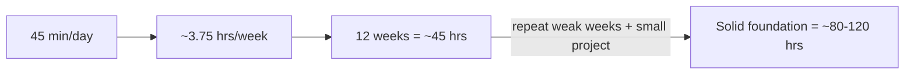

# Real Expectations for Your Java API Plan

## What this plan actually builds

Your setup in [habits.md](habits.md) and [api-notes.md](api-notes.md) is designed for **breadth + recall**, not memorizing every method.

| After completing... | You will realistically have... |
|---------------------|-------------------------------|
| **Weeks 1–2** (Ch 4) | Comfort reading generics, lambdas, `record`, `Optional` in other code |
| **Weeks 3–4** (Ch 8) | Ability to pick `List` vs `Set` vs `Map`, write basic Streams, avoid reimplementing collections |
| **Weeks 5–6** (Ch 9) | Confidence with `String`/regex and `java.time` for everyday tasks |
| **Weeks 7–8** (Ch 10) | Ability to read/write files with `Path` + `Files` (modern I/O) |
| **Weeks 9–10** (Ch 6) | Awareness of threads/executors; not production concurrency mastery |
| **Weeks 11–12** (Ch 11–13) | Know reflection/modules/tools exist; look them up when needed |

**Bottom line:** Finishing the 12-week pass means you know **what the platform offers** and **where to look** — not that you have every API in muscle memory.

---

## Time math (as planned)

| Pace | Weekly hours | First pass (12 weeks) | Solid foundation |
|------|--------------|----------------------|------------------|
| **5 days/week** (planned) | ~3.75 hrs | ~12 weeks / **45 hrs** | **4–6 months** / **80–120 hrs** |
| 3 days/week | ~2.25 hrs | ~20 weeks / 45 hrs | ~6–9 months |
| 7 days/week | ~5.25 hrs | ~9 weeks / 45 hrs | ~3–4 months |

**Solid foundation** here means: you reach for the right JDK API without opening the book, and Javadoc is for edge cases — not for “how do I filter a list?”

---

## What “solid” looks like in practice

You have a solid foundation when you can do these **without** the book:

1. **Collections** — Load data into `Map`/`List`, filter/transform with Streams, collect results
2. **Dates** — Parse, compare, format with `java.time` (not legacy `Date`)
3. **Files** — Read lines, write output, walk a directory with `Files`
4. **Types** — Read code using generics, lambdas, and `Optional` and know what it does
5. **Lookup habit** — For anything else, open Javadoc and find the right class in under 2 minutes

You do **not** need to memorize: reflection APIs, module descriptors, NIO channels, or async I/O details — those stay reference material unless your job requires them.

---

## Honest milestones

### ~4 weeks in (Type System + Collections done)
- **Expectation:** Working familiarity — you can complete small exercises using `List`, `Map`, `Stream` with docs nearby
- **Reality check:** Friday combine exercises should feel doable; if not, repeat Week 3–4 (your [habits.md](habits.md) rule is correct)

### ~8 weeks in (+ Data Formats + I/O)
- **Expectation:** Daily-use APIs covered — this is the **highest ROI** stretch
- **You can:** Build a small CLI tool (read file → process → write report) using only JDK APIs

### ~12 weeks in (full first pass)
- **Expectation:** Platform map in your head — you’ve **touched** every major area in *Java in a Nutshell* Part II
- **You cannot yet:** Claim concurrency or metaprogramming mastery from 45-min drills alone

### ~4–6 months total (solid foundation)
- **Requires:** First pass + repeating 1–2 weak phases + one **small project** (50–100 lines) that combines Collections + `java.time` + `Files`
- **Outcome:** Interview-ready for “core Java” and productive on real tasks with occasional Javadoc lookups

---

## What the daily 45 minutes is worth

Each session buys you one of these — not all at once:

- **Habit 1 (25 min)** — motor skill: typing API calls correctly
- **Habit 2 (15 min)** — mental map: linking problem → package → class
- **Habit 3 (5 min)** — long-term retention: the index card is what you’ll remember in 3 months

Skipping Habit 2 or 3 saves time short-term but adds **weeks** to reaching “solid” because you won’t retain *when* to use each API.

---

## Common traps (adjust expectations if these happen)

| Trap | Effect on timeline |
|------|-------------------|
| Reading whole chapters instead of one subsection | Plan stretches from 12 weeks → 20+ weeks |
| Perfect attendance but no Friday combine | Know APIs in isolation, struggle combining them (+4–8 weeks) |
| Moving on when Friday review fails | Shaky foundation; Collections gaps hurt everything after |
| No real project after Week 8 | Stays “textbook familiar” instead of “solid” (+2–3 months) |

---

## Recommended success criteria

Call the plan **working** when:
- [ ] 20+ index cards in [api-notes.md](api-notes.md) you can explain aloud
- [ ] Friday combine programs run without copying earlier days’ code
- [ ] One small project uses `List`/`Map`/`Stream` + `java.time` + `Files.readAllLines`/`write`

Call it **solid** when:
- [ ] You complete the above **twice** (second pass on weak weeks)
- [ ] You read unfamiliar Java code and recognize which JDK packages are in play
- [ ] You choose `Files` over `FileReader`, `LocalDate` over `Date`, and `HashMap` vs `HashSet` instinctively

---

## Checkpoints

- **Week 4:** Verify Friday combine (Collections) passes without the book — repeat the week if not
- **Week 8:** Build one CLI tool combining Streams + `java.time` + `Files` (50–100 lines)
- **Month 4:** Repeat your weakest 2-week phase and refresh index cards in [api-notes.md](api-notes.md)

---

## Practical recommendation

**Minimum viable commitment:** 5 days × 45 min for **16 weeks** (12-week pass + 4 weeks repeat/project), not 12 weeks alone.

**Best ROI order if time is limited:** Weeks 3–4 → 5–6 → 7–8 first. Skip or skim Weeks 11–12 until you need them.

Your plan is realistic and efficient for building a **reference-grade mental map** of the JDK. Solid, instinctive API use comes from the same routine sustained **~4–6 months**, with one small integrative project around Week 8–10.
